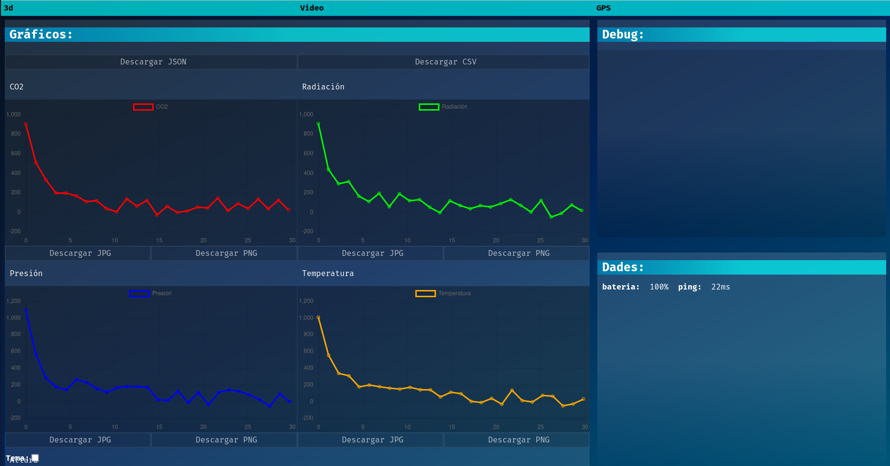
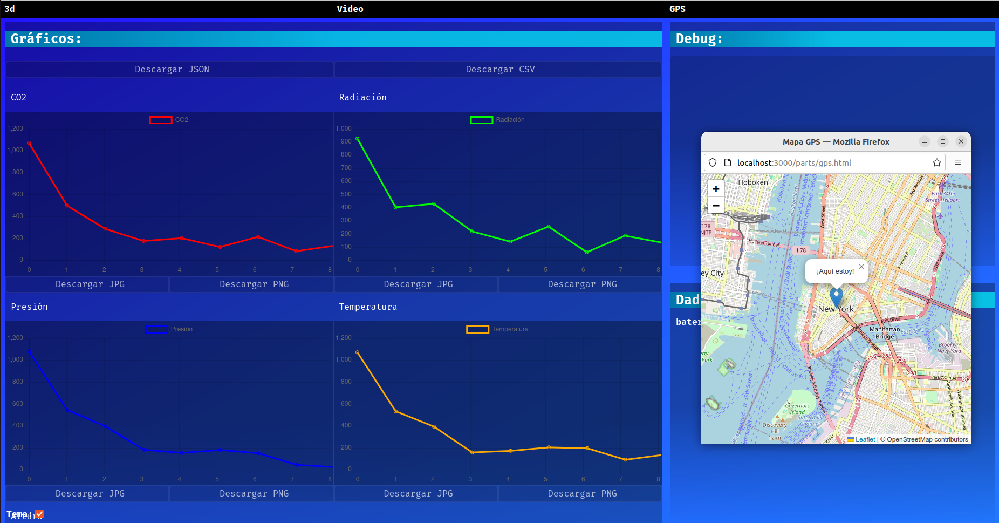

# Cansat 2024 Groundstation

A web graphic, based on windows, aplication which shows data from the satellite.

## How to use

On Bash: `chmod +x compile.sh` and `./compile.sh` or `node server.js`. On Bach: `node server.js` or make a .bat yourserf, silly windows user :)

You can allso use it without node. Just opening the index.html file on the browser. However, the light theme wouldn't work properly, like other functionalities as well.

