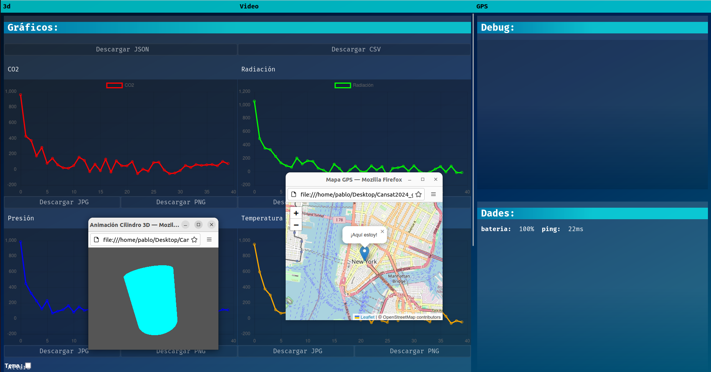

# Cansat 2024 Groundstation

A web graphic, based on windows, aplication which shows data from the satellite.

## How to use

On Bash: `chmod +x compile.sh` and `./compile.sh` or `node server.js`. On Bach: `node server.js` or make a .bat yourserf, silly windows user :)

You can allso use it without node. Just opening the index.html file in the browser. However, the light theme wouldn't work properly, like other functionalities as well.

The application is still in development, as its values ​​are all invented and not related to a connex. *There is a crash when downloading something or changing the theme and then using the app behind another. The reason still unkrown*.
